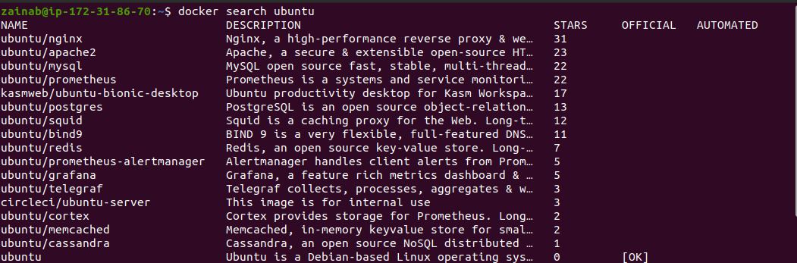
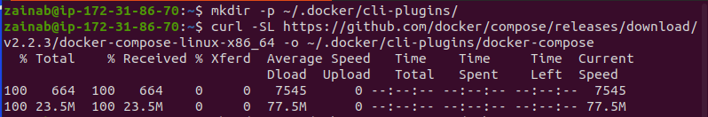

# Project3WebAnalytics

## Deploying Matomo Web Analytics on cloud

To get started, we need an Ubuntu 20.04 server with UFW firewall enabled. 

### what is UFW firewall?

UFW - Uncomplicated Firewall is a firewall configuration tool that runs on top of `iptables`, included by default within Ubuntu distributions. It is a program for managing a netfilter firewall designed to be easy to use.

### Provisioning an Instance and Setting Up a Firewall

**Step 1**

We need to sign up or sign-in to our cloud provider account to provision an instance (server). In our case, we will use AWS service. Navigate to the EC2 page by searching ***EC2*** in the search box  and then clicking ***launch instance***. 

On the Amazon Machine Image page, select *Ubuntu Server 20.04 LTS (HVM). SSD Volume Type*. On the Instance Type page, select *t2.micro* and click *Review and Launch*. 

Launch the instance. We will be asked to create a new key pair or choose an existing one
 
**Note: Keep your key-pair safe because it is needed to access your instance from your command line**.

To connect your instance to your local machine/terminal:

    $ ssh -i <Your-private-key.pem> ubuntu@<EC2-Public-IP-address>

To avoid getting the error *Bad permissions* change the permission for the private key in the terminal using `chmod`. 

*Chmod is the command used to change the access permission of file system objects. It allows you to control exactly who is able to read, edit or run your file*. 

    $ sudo chmod 0400 <Your-private-key.pem>

**Step 2**
	
Once connected, we need to access the root user, run the command:

    $ sudo su

or 

    $ sudo -s

**Step 3**

It is not advisable to run commands using the root, so we will create a new user. We will be asked to create a password for the user and complete additional information which is optional. 

To create new user, run:

    # adduser username 

>

The next step is to grant our user administrative privileges by making it a superuser or giving it root privilege. 

To do this, we add the user to a sudo group. run:

    # usermod -aG sudo username

#### Setting a Basic Firewall

**Step 4**

To ensure only connections from certain services are allowed, we need to set up a basic firewall using UFW firewall.

OpenSSh, the service that allows connection to our server, should have a profile registered with UFW. To check this, type:

      # ufw app list 

>Output :
>
>

Ensure firewall allows SSH connection, so you can log back in by:

    # ufw allow OpenSSH

Next enable firewall:

    # ufw enable 

Type `Y` and press `ENTER` to proceed

To check SSH connections are still allowed, run: 

    # ufw status 

>Output: 
>
>

### Enabling External Access for the Regular user

You need to make sure that the new user setup can SSH into the account directly since we will use it to complete all our tasks.

    # su username 

To enhance server security, it is recommended to set up SSH keys instead of using password authentication. 

*SSH, known as Secure Shell or Secure Socket Shell, is a network protocol that gives users a secure way to access a computer over an unsecured network. SSH provides strong password authentication and public key authentication. The SSH key is an access credential in the SSH protocol. Its function is similar to that of usernames and passwords, but the keys are primarily used for automated processes.*

**Step 1**

#### Creating a key pair

The first step is to run:

    $ ssh-keygen 

We will receive an output with a file path where the key will be saved on the home directory. You can accept the path or choose an alternative path. 

>

Press `ENTER` to continue

The next prompt will ask us for a passphrase which is optional but adds an additional layer of security. Press `ENTER`, you will be asked to retype the passphrase and then press `ENTER` again

> Output 
>
>

We have successfully created a public and private key. The next step is to place the public key on our server. 

**Step 2**

#### Copying the Public Key to our Ubuntu Server

The easiest way to copy the public key to Ubuntu is using the utility called `ssh-copy-id`. This tool is included by default in many operating systems but for it to work, you must already have password-based SSH access to your server.

Run:

    $ ssh-copy-id username@remote_host 

If you get a permission denied (public key) error, run the below:

    $ sudo nano /etc/ssh/sshd_config

  >change: PermitRootLogin prohibit-password to PermitRootLogin no 
  >
  >PasswordAuthentication no to PasswordAuthentication yes

save and exit the editor

then restart the ssh service:

    $ sudo service ssh restart

Now you can run:

    $ ssh-copy-id username@remote_host 

You will be prompted to enter the user password. 

>Output
>
>

**Step 3**

#### Authenticating your Ubuntu server using SSH Keys

We have successfully completed the above steps, now we need to run the below command and should not get a prompt to provide the account user's password:

    ssh username@remote_host 

>

**Step 4**

#### Disabling Password Authentication on Your Server

If you are able to log in using SSH without password, you have successfully configured SSH-key-based authentication on your account. The password-based authentication is still active, which means that your server is still exposed.

open the SSH daemon's configuration file:

    $ sudo nano /etc/ssh/sshd_config

In the editor, search for the line ***PasswordAuthentication*** and set the value to ***no***. 

  >*PubKeyAuthentication* set to yes

Note: the line may be commented out with `#`, simply remove the `#` to uncomment the line. 

save and close the file 

To activate the changes made, restart the service:

    $ sudo systemctl restart ssh

### Installing Docker

*Docker is an open source containerization platform that allows you to build, test and deploy applications quickly. It is used to create standardized executable components combining application source code with the operating system(OS) libraries and dependencies required to run that code in any environment.* 

Docker is available in the official Ubuntu repository but may not be the latest version. To ensure the latest version is installed, it will be installed from the official Docker repository. 

**Step 1**
To get started, we need to update our existing package by running:

    $ sudo apt update

Next, we need to run some prerequisite packages, click `Y` when prompted:

    $ sudo apt install apt-transport-https ca-certificates curl software-properties-common 

>

Now we need to add the GPG key for the official Docker repo:

     $ curl -fsSL https://download.docker.com/linux/ubuntu/gpg | sudo apt-key add - 

>

Next we add the docker repository to `APT` sources:

    $ sudo add-apt-repository "deb [arch=amd64] https://download.docker.com/linux/ubuntu focal stable"

To make sure we installed from the docker repository instead of the default Ubuntu repo, run:

    $ apt-cache policy docker-ce

>Output
>
>

Now to install Docker, run the command and press `Y` and `ENTER` when prompted:

    $ sudo apt install docker-ce

Our Docker is installed and daemon started. To check that it is running:

    $ sudo systemctl status docker 

>

**Step 2**

#### Running Docker Command without Sudo

By default, docker commands can only be run by the root user or users in the docker group without prefixing the command with `sudo`. To avoid an error and also typing sudo for every docker command, add your username to the group, start by using the below:

     $ sudo usermod -aG docker ${USER}

To apply the changes (new group membership), log out and log back in or run:

    $ su - ${USER}

>*Note: You will be prompted to enter a password. *

To confirm that the user is added to the docker group:

    $ id -nG

or 

     $ groups 

>Output:
>
>

**Step 3**

#### Using the Docker Commands

The syntax for  a docker command is:

     $ docker [option] [command] [arguments]

To view all available subcommands, type:

    $ docker

To view system-wide information about Docker, use:

    $ docker info

**Step 4**

#### Working with Docker Images

*A Docker image is a read-only static template that contains instructions for deploying containers that run on the Docker platform.* 

To check if we have access and can download images from Docker Hub, type:

    $ docker run hello-world

>Output: 
>
>

This means that we have access and can use Docker Hub

To search for images available on Docker Hub, use the `docker` command with the `search` subcommand

Example: Let's search for the Ubuntu image:

    $ docker search ubuntu

The script will crawl Docker Hub and return a listing of all images whose name matches the search string, in our case *Ubuntu*. 

>Output: 
>
>

To download the image to your computer, we use the `pull` subcommand:

     $ docker pull ubuntu

>

Once an image has been downloaded, you can run a container using the downloaded image with the `run` subcommand. 

To display/check images that have been downloaded to your computer, run:

    $ docker images

>Output 
>
>

**Step 5**

#### Running a Docker Container 

*Docker Containers are the ready applications created from Docker Images. It is a lightweight, standalone, executable package of software that includes everything needed to run an application. Containers are similar to virtual machines, only more resource-friendly, fast and boots quickly.*

**Prerequisite**

Ubuntu server 20.04, including a sudo non-root user and a firewall

An account on Docker Hub if you wish to create your own image and push them to Docker Hub as we will do later in this guide. 

To run a container using the latest image of ubuntu, the combination use of the -i and -t switches are used to give our interactive shell access into the container:

    $ docker run -it ubuntu

The command prompt changes and reflects that we are working inside the container

>Output:
>
>root@7450d5804110:/# 

*Observe the container id in the command prompt after the `@` symbol. It is required to identify the container when you want to remove it.*

While working in the container, we don't need the prefix `sudo` to run a command since we are operating as the root user. To update the package database inside the container, simply run:

    # apt update 

To install an application, example Node.js:

    # apt install nodejs

We will get a prompt to choose our location, and area before completing the installation.

To verify that it is installed:

    # node -v

>Output: 
>
>

*Note: Any changes made inside the container, only apply to that container.*

To exit the container, type `exit`

**Step 6** 

#### Managing Docker Containers

After using Docker for a while, we will have many active and inactive containers on our computer. To view active containers:

     $ docker ps

>

To view all containers; active and inactive, run `docker` `ps` with the `-a` switch:

     $ docker ps -a

>

To view the latest container created:

    $ docker ps -l 

To start a stopped container, use `docker start` followed by the `container id`. 

Example:

    $ docker start fb8761a3719c

Use `docker ps` to check the status 

>

To stop a running container, use `docker stop` followed by the `container id or name`. 

*Note: Docker assigns a name to your container*

     $ docker stop magical_golick

Once we no longer need the container, we use the `docker rm` command to remove it. 

Example: Let’s remove the container for `hello-world`. To find the ID or container name, run:

    $ docker ps -a 

To remove:

    $ docker rm romantic_saha

**Step 7**

#### Committing Changes in A Container to a Docker Image

When we start a docker image, we can create, modify and delete files like a virtual machine. 

We will explore how to save the state of a container as a new Docker image. To do this, let’s use the Ubuntu container we installed Node.js on as the basis for the new image. 

To commit the changes to a new Docker image instance, use:

>docker commit -m "What you did to the image" -a "Author Name" container_id repository/new_image_name

The `-m` switch is for the commit message that shows others the changes you made. The `-a` specifies the author, the `container-id` is from your existing container or created container. Unless you have created additional repositories on Docker Hub, the repository is usually your Docker Hub username.

>Example:
>
>

When we commit an image, the image is saved locally on our computer. Listing the Docker images, we can display the new image as well as the old one it was derived from. 

     $ docker images

>

We can now run a container using Ubuntu with Node.js installed by running the new image. 

*Note: You are able to build images from a `Dockerfile` which allows you to automate the installation of software in a new image.*  

The next step is sharing the new image with others. 

**Step 8** 

#### Pushing Docker Images to a Docker Repository. 

After creating a new image, we might want to share it with others either through Docker Hub or other Docker registry. 

To push the image, first we log into Docker Hub:

     $ docker login -u docker_hub_username

>

If our Docker registry username is different from the local username used to create the image, we will have to tag our image with the registry username. For the example given in the last step, we would type:

    $ docker tag zainab/ubuntu-nodejs docker_registry_username/ubuntu-nodejs

Then we can push the image using:

    $ docker push docker_hub_username/docker_image_name 

>

We can login to our Docker Hub account via the web browser to verify that the image has been pushed.

>

Using the command `docker pull` we can pull an image from Docker Hub into our machine to run as a new container.

### Docker Compose Installation

Docker Compose is a tool used to run multiple containers as a single service using the Compose file format. It is an important tool for any application that needs multiple microservices, as it allows each service to easily be in a separately managed container. With Compose, we can create a `YAML` file to define the services and with a single command, we can spin everything up or tear it all down. 

**Prerequisite**

Access to Ubuntu 20.04 server or development server as a non-root user with sudo. If using a remote server, it is advisable to have an active firewall installed

Docker installed on your server or local machine 

**Step 1**

To install the most updated stable version of Docker Compose, download the software from its official Github repository.

First, confirm the latest version available in their releases page (https://github.com/docker/compose/releases). At the time of writing this guide, the most current stable version is  "2.2.3"

The command will download the 2.2.3 release and save the executable file at `/usr/local/bin/docker-compose` which will make the software globally accessible as `docker-compose`.

First we need to create a new directory

     $ mkdir -p ~/.docker/cli-plugins/

next, download the docker compose binary file from Github with curl:

    $ curl -SL https://github.com/docker/compose/releases/download/v2.2.3/docker-compose-linux-x86_64 -o ~/.docker/cli-plugins/docker-compose

>

We need to make the downloaded binary executable:

    $ chmod +x ~/.docker/cli-plugins/docker-compose

To verify the installation was successful, we run:

     $ docker compose version

>output 
>
>Docker Compose version v2.2.3

Compose is now successfully installed on our system. 

**Step 2**

#### Setting Up a `docker compose yml` file

To set up a `docker-compose.yml` file and work with Docker compose, we need to create a web server environment using an Nginx image from Docker Hub. 

This containerized environment will serve as a single static HTML file. 

Now proceed by creating a new directory in your home folder and moving into the directory:

    $ mkdir ~/compose-demo

    $ cd ~/compose-demo 

Next, we create an application folder to serve as the root for our Nginx environment:

    $ mkdir app

>

Using a preferred text editor, create a new `index.html` file in the app directory. I will be using `nano`:

    $ nano app/index.html

Place the following content into the file:

    
    <!doctype html>
    <html lang="en">
    <head>
       <meta charset="utf-8">
       <title>Docker Compose Demo</title>
       <link rel="stylesheet" href="https://cdn.jsdelivr.net/gh/kognise/water.css@latest/dist/dark.min.css">
    </head>
    <body>
    	<h1>This is a Docker Compose Demo Page.</h1>
        
This content is being served by an Nginx container.

    
    </body>
    </html>

save and close the file by pressing `CTRL + X`, press `Y` and `ENTER`. 

Next create the docker-compose.yml:

    $ nano docker-compose.yml 

Insert the following content in your `docker-compose.yml` file :

    
    version: '3.7'
    services:
      web:
      image: nginx:alpine
      ports:
         - "8000:80"
       volumes:
        - ./app:/usr/share/nginx/html
    

The file starts off with the version, telling *Docker Compose* which configuration version we're using. 
Next is the services block, where we set up the services that are part of this environment. In our case, we have a single service called web. This service uses the `nginx:alpine` image and sets up a port redirection with the ports directive. 

Finally we have the volumes directive which creates a shared volume between the host machine and the container. 

**Step 3**

#### Running Docker Compose

Now that we have set up the `docker-compose.yml` file, we can execute *Docker Compose* to bring the environment up. The below command will download the necessary Docker images, create a container for the web service and run the containerized environment in background mode:

    $ docker compose up -d

>

Our environment is running in the background. To verify that it is active, run:

    $ docker compose ps

>Output:
>
>

We can now access the demo application by running `localhost : 8000` on our local machine or `your_server_domain or IP:8000` in our web browser. 

>

**Step 4**

#### Understanding Docker Compose Commands

To check the logs produced by the Nginx container, we use the logs command:

    $ docker compose logs

>

Another command is `pause`. It is used to pause the environment execution without changing the current state of the container:

     $ docker compose pause

>Output:
>
>

To resume execution:

    $ docker compose unpause

>

Now let's look at the `stop` command. It terminates the container execution but does not destroy any data associated with the container:

    $ docker compose stop

>

To remove the containers, networks, and volumes associated with this container environment, use:

    $ docker compose down

>

This does not remove the base image used by Docker Compose to spin the environment. 

To remove the base image, run:

    $ docker image rm nginx:alpine

>

### Downloading and Launching Matomo Software 

**Step 1**

Now that docker compose is working, the next step is to enable SSL. We will need a domain name pointed at our server's public IP address. 

We can create a new domain from any *Domain Registrar* such as Freenom, Godaddy, Google Domain. This will let us manage the domain's DNS records with the control panel and API. For this guide, we will use Google Domain.

To set up a domain with our cloud account, follow the next steps:

* From the dashboard of our registrar, click DNS
* Under custom records, we will select the domain name we want to use for this project
* Click manage custom records and complete the information:
* Type: *A*
* TTL: *3600*
* Data: Enter your instance IP address or Instance elastic IP address

Save your record and close your registrar

**Step 2**

#### Running Matomo and MariaDB with Docker Compose

First create a Docker Compose configuration that will launch containers for both Matomo app and MariaDB database

To do this, we need to start from the home directory:

    $ cd ~

Then create a directory for matomo and move into the directory:

    $ mkdir matomo

    $ cd matomo

Next, open a new blank YAMl file called `docker-compose.yml`:

     $ nano docker-compose.yml 

This is the configuration file that `docker-compose` will read when bringing up our container. Paste the below as content for the file:

    
    version: "3"
    
    services:
     db:
       image: mariadb
      command: --max-allowed-packet=64MB
       restart: always
       environment:
        - MARIADB_DATABASE=matomo
         - MARIADB_USER
         - MARIADB_PASSWORD
         - MARIADB_ROOT_PASSWORD
       volumes:
         - ./db:/var/lib/mysql
    
     app:
       image: matomo
       restart: always
       volumes:
         - ./matomo:/var/www/html
       ports:
         - 127.0.0.1:8080:80
    

Save the file and exit your editor. 

The file defines two services, one `db` service for the MariaDB container, and an `app` service for the Matomo software. 

The MariaDB container needs some configuration to be passed to its environment variables in order to function. The `docker-compose.yml` file lists these variables, but not all of them have associated values. This is because it’s good practice to keep passwords out of your `docker-compose.yml` file especially if you will commit it to a Git repository or other source control systems. 
The necessary files will be saved in a `.env` file in the same directory which the `docker-compose` will load when we start our containers. 

Open a new `.env` file with `nano`:

    $ nano .env

You will need to fill in a username and the password as well as the password for the database root account.

A way to  generate a random strong 30 character hash password is using the openssl command:

    $ openssl rand 30 | base64 -w 0; echo 

Once you have the password, complete the below content into your `.env` file:

    
    MARIADB_USER=matomo
    MARIADB_PASSWORD=a_strong_password_for_user
    MARIADB_ROOT_PASSWORD=a_strong_password_for_root
    

save and exit the editor.

Now you can bring up or start the two containers using docker compose:

    $ docker compose up -d

>Output:
>
>

Once done, Matomo should be running. To test that it is running:

     $ curl --head http://localhost:8080

>

The `200 ok` means that the Matomo server is up and running but only available on localhost. `X-Matomo Request-Id` indicates the request is coming from Matomo and not another application using port 8080. 

**Step 3**

#### Installing and Configuring Nginx

*Nginx, pronounced as ‘Engine-x’  is the second most widely used web server after Apache. It supports all Unix-like systems and partially supports windows. It is compatible with commonly-used applications and fast for serving static files.* 

We need to set up Nginx to proxy public traffic to the Matomo container. 

First, we refresh our package list using `apt` update:

    $ sudo apt update 

then install Nginx:

    $ sudo apt install nginx

Allow public traffic to ports `80` and `443` (HTTP and HTTPS) using the "Nginx Full" UFW application:

    $ sudo ufw allow "Nginx Full"

>

Next, we open a new Nginx configuration file which we will call `matomo.conf`:

    $ sudo nano /etc/nginx/sites-available/matomo.conf

In the configuration file, post the below content and replace `your_domain_here` with your actual domain name.  

    
    server {
       listen       80;
       listen       [::]:80;
       server_name  your_domain_here;
    
       access_log  /var/log/nginx/matomo.access.log;
       error_log   /var/log/nginx/matomo.error.log;
    
       location / {
         proxy_set_header X-Forwarded-For $proxy_add_x_forwarded_for;
         proxy_set_header X-Real-IP $remote_addr;
         proxy_set_header X-Forwarded-Host $host;
         proxy_set_header X-Forwarded-Proto https;
         proxy_pass http://localhost:8080;
      }
    }

Save and close the file. Now we need to enable the configuration by linking it into `/etc/nginx/sites-enabled/`:

    $ sudo ln -s /etc/nginx/sites-available/matomo.conf /etc/nginx/sites-enabled/

We can verify that the configuration file syntax is correct using:

    $ sudo nginx -t

>Output: 

>

Finally, we reload the nginx service to pick up the new configuration:

    $ sudo systemctl reload nginx

Our matomo site should now be available on plain HTTP. In the browser, type `http://your_domain_here`.

>

Now that the site is up and running over HTTP, it is time to secure the connection with Certbot and Let's Encrypt certificates. This should be done before completing the Matomo web-based setup procedure. 

**Step 4**

#### Installing Certbot and Setting up SSL Certificates 

Using Certbot and Let's encrypt makes adding SSL encryption to the Matomo app easy with only two commands.

First we install Certbot and its Nginx plugin:

    $ sudo apt install certbot python3-certbot-nginx

Next, run `certbot` in `--nginx` mode and specify the domain used in the Nginx config:

    $ sudo certbot --nginx -d your_domain_here

There will be a prompt to agree to the terms of service and enter an email address. We will also be asked if we want to redirect and it is advisable to redirect from HTTP to HTTPS.

>

Output when everything is okay 

>

Certbot will automatically reload Nginx to pick up the new configuration and certificates, reload the site and switch over to HTTPS automatically if we chose that option. 

**Step 5**

#### Setting up Matomo

Once we refresh the browser or go back to our domain name, we click the ***Next*** button to go to ***System Check*** setup. 

Everything on the system check page should be green to indicate there are no problems. Scroll all the way to the bottom and click ***Next***.

We will be directed to the ***Database Setup*** page:

Fill Out the first four fields:

**Database Server**: db

**Login**: the `MariaDB_user` from the `.env` file

**Password**: `MariaDB_password` from the `.env` file

**Database Name**: matomo 

Continue to click ***Next***, set up the website you want to collect analytics for, click ***Next*** until you get to the ***Congratulations*** page. 

>

Click ***Continue*** to Matomo

Output: 

>

There would be a warning sign on this page. To complete the process and remove the warning sign, we need to update our configuration file:

    $ sudo nano matomo/config/config.ini.php

Add the below content to the bottom of the `[General]` section"

    
    trusted_hosts[] = "localhost:8080"
    assume_secure_protocol = 1
    force_ssl = 1

>

Save and exit the editor

The options added lets Matomo know it is safe to use port `8080` and to assume it is always being accessed over a secure connection. 

We can now switch back to our web browser and refresh the page. The warning sign should be gone and a sign in /login page displayed.  

>

Log in with the admin account you created during setup and we will be taken to a dashboard

>

We have not set up any tracking code, hence the dashboard indicates that no data has been recorded. We will need to set up the JavaScript code to start receiving analytics data.

**We have successfully launched the Matomo analytics app, set up a MariaDB database using Docker Compose and set up an Nginx reverse proxy securing it with SSL certificates**. 

